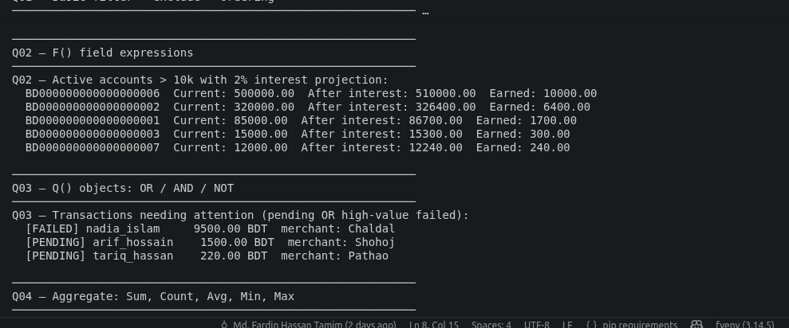
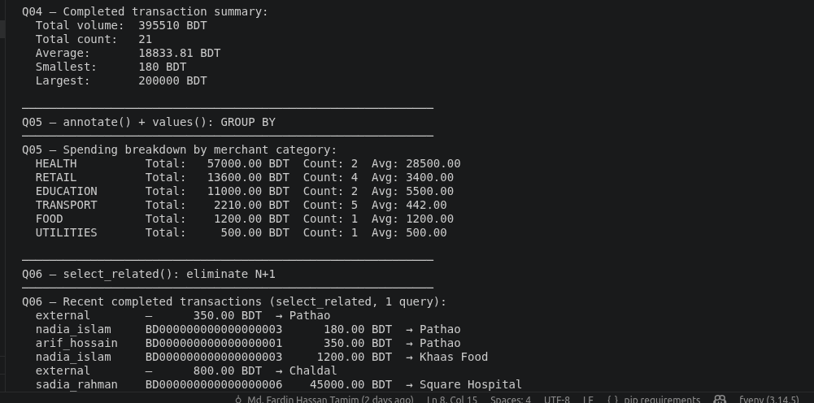

# Fintech ORM Project (Django)

A backend-focused fintech simulation project built with Django ORM to practice real-world financial data modeling, relational database design, and advanced query patterns.

## Features

- Custom User model 
- Bank account system 
- Transaction system (credit, debit, transfer, refund)
- Card management (debit/credit card simulation)
- Merchant model for transaction categorization
- Advanced Django ORM queries

